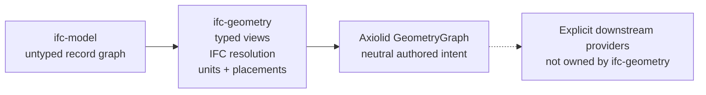

# The Axiolid boundary

`ifc-geometry` is a **bridge**, not a geometry engine. This page states exactly
where the responsibility transfers, because misunderstanding this boundary is
the most common way to over-estimate what the crate can do.

## The split



**`ifc-geometry` answers:** what does this IFC entity *mean* geometrically?
Which profile, which placement, which units, which representation, which
sub-shape does an `IfcMappedItem` reuse?

**Axiolid answers:** what do I compute with that meaning?

`ifc-geometry` implements no geometry itself:

> It does not triangulate, evaluate NURBS, or perform booleans.

That is a design commitment, not a temporary limitation. Since the
[ADR 0004 amendment](/adr/0004-geometry-bridge-not-kernel), the opt-in
`compile` feature may *call* a provider that does — see
[Compilation](#compilation-opt-in) below. The bridge still writes no
algorithm. Geometry algorithms
belong to a format-neutral kernel so they are not re-implemented per file
format, and so the IFC crate never grows a dependency on a CPU or GPU provider.
`ifc-geometry/tests/no_backend_dependency.rs` enforces the second half.

## Consequences you must plan for

**Curve representation is not curve evaluation.** `ifc-geometry` reads an
`IfcBSplineCurveWithKnots` into a neutral B-spline description. Producing points
along it is an Axiolid concern. If you need discretised geometry — for drawing,
export, or measurement — that call is downstream of this crate.

**Booleans are represented, not executed** in the default build.
`IfcBooleanResult` lowers into a DAG node describing the operation and its
operands. Evaluating it requires a mesh Boolean provider, which the `compile`
feature supplies.

**Sectioning remains downstream.** Axiolid now provides a neutral
`MeshPlaneSection` contract and a portable reference implementation over an
explicit `TriMesh`, with bounded evidence and refusal semantics. `ifc-geometry`
does not call it or manufacture plan representations from body geometry. An
application may select an authored IFC plan representation, or explicitly
lower and compile body geometry before invoking the opt-in Axiolid operation.

**Axiolid is a contract kernel more than an algorithm library.** Much of it
defines neutral vocabulary and validated representations; a smaller portion is
executable algorithms. Check Axiolid's own capability documentation rather than
assuming an operation exists because a crate named after it does. Its
[geometry concepts guide](https://axiolid.github.io/kernel/guide/geometry-concepts)
uses interactive STL examples and equations to explain profiles, mesh orientation,
tolerance, and the representation/execution distinction.

## What Axiolid does provide

Verified at the revision pinned by this workspace:

- Exact and filtered geometric predicates (`orient2d`, `incircle`, `insphere`)
  with degeneracy tests — a correctness oracle.
- Polygon ring utilities: signed area and orientation.
- Ear-clipping triangulation for hole-free rings, and an Earcut-backed
  triangulation provider.
- Neutral values for primitives, profiles, curves, surfaces, and B-rep topology.
- Scalar reference evaluation for polynomial and rational B-spline curves and
  surfaces, including analytic first surface partials.
- An immutable shared geometry DAG with typed IDs.
- A mesh Boolean provider, bounded by its own mesh contract.
- A neutral mesh-plane-section contract plus portable reference implementation,
  with bounded evidence/refusal semantics.
- CPU context and a GPU seam — a seam, not a bundled kernel suite.

## Compilation (opt-in)

`--features compile` connects lowering to evaluation:

```rust
use axiolid_core::Tolerance;
use ifc_geometry::compile::compile_product_mesh;

let mesh = compile_product_mesh(&model, product, Tolerance::MILLIMETRE)?;
```

`Ok(None)` means the product carries no body representation, which is ordinary.
A product that cannot be evaluated returns `GeometryError::CompilationRefused`
carrying the provider's own reason — distinct from `Unsupported`, which means
lowering never produced a DAG in the first place.

**Gross and net.** The Body representation is the gross shape; the file never
authors the result of subtracting its openings. `compile_product_mesh` stays
gross. `compile_product_mesh_net` subtracts every `IfcRelVoidsElement` opening
as an exact boolean and reports which openings it removed; an opening that
cannot be removed is `GeometryError::OpeningNotSubtracted` naming it, never a
quietly uncut mesh. See [ADR 0014](/adr/0014-net-geometry-is-an-explicit-request).

**Off by default, and checked.** `tests/kernel_free_build.rs` asserts that the
`--no-default-features` and default columns link zero provider crates, and that
`--features compile` links them. `ifc-model/tests/package_architecture.rs`
walks the feature graph from `default` so a provider cannot arrive through a
default-enabled feature edge.

**Refusals are real.** `tests/compile_pairing.rs` runs a fixture corpus through
lowering and compilation and asserts every product reaches a typed answer.
`union_over_halfspace_unbounded.ifc` exists to be refused: a UNION whose right
operand is a half-space is unbounded, so no finite mesh exists. Without it the
refusal branch would never execute and its assertion would be unfalsifiable.

**Tolerance is in model units.** Lowering converts every length to metres, so
`Tolerance::MILLIMETRE` (1e-3) is a millimetre regardless of what the file
declared. Deriving a tolerance from the file's unit scale would apply the
conversion twice.

## The pin

The workspace pins Axiolid crates to an exact git revision rather than a
version range, so geometry behaviour is reproducible across builds:

```toml
axiolid-core = { git = "https://github.com/axiolid/kernel.git", tag = "v0.1.8" }
```

Production lowering pins only representation-level crates — `core`, `mesh`,
`model`, `primitive`, `profile`, `curve`, `surface`, and `topology`.
`axiolid-reference` is a dev-only oracle used by import regressions; it does not
enter the published adapter's production dependency graph.
