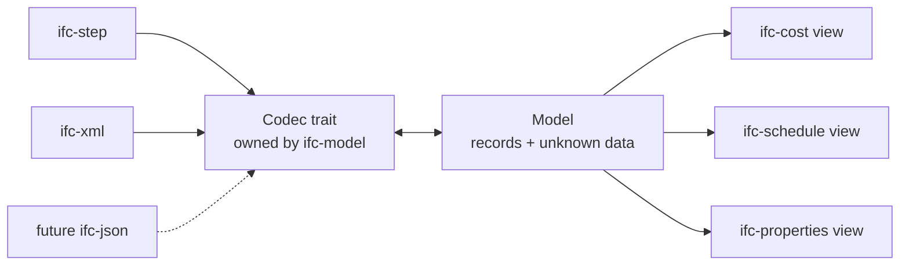
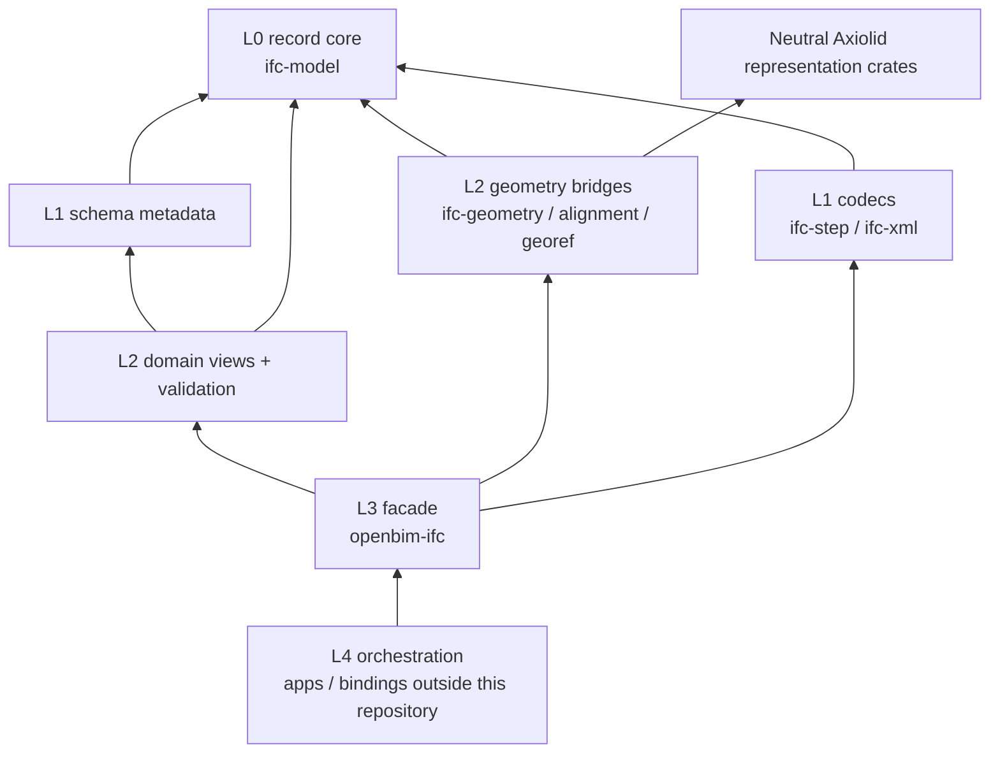

# System design

`openbim-ifc` is built around two separations. Both are enforced by tests rather
than by convention, and almost every other design choice follows from them.

## 1. The model knows no domain semantics

`ifc-model::Model` stores `(id, type_name, attributes)`. It has never heard of a
wall, a cost item, or a task. Domain crates are **views** that borrow a `&Model`
and interpret it.

Three consequences, in order of importance:

**Data you do not understand still round-trips.** A file full of cost entities
parses and re-exports intact in a build compiled with *no cost crate at all*,
because storage is structural rather than a domain struct. This is the property
that makes the project safe to use while large parts of it remain unimplemented.
Verified by `openbim-ifc/tests/costing_roundtrip.rs`.

**Thin applications stay thin.** A viewer compiles only the domains it selects.
Verified by `openbim-ifc/tests/thin_build.rs`.

**Interpretations are replaceable.** A different reading of the same entities is
another crate, not a fork of the model.

## 2. The model knows no serialization

`Codec` is a trait *in the model crate*; `ifc-step` and `ifc-xml` implement it.
IFC-JSON would be a third implementation requiring no change to the model.

Format conversion is therefore not a feature — it is reading with one codec and
writing with another.

Codecs never import domain semantics. Domain crates never import codecs.

## Dependency tiers

Dependencies point down. Sibling domain crates do not depend on one another;
cross-domain workflows belong at L4. `ifc-model` remains schema-, codec-, and
domain-agnostic.

## Partitioning by pipeline role, not by IFC schema name

IFC resource names are evidence, not crate boundaries. The schema mixes storage,
geometry input, presentation, and domain semantics in the same resource
documents, so the crate layout follows the role a declaration plays:

1. Geometry input is lowered by `ifc-geometry`, `ifc-alignment`, or `ifc-georef`
   into format-neutral geometry values.
2. Domain semantics are borrowed projections over `ifc-model`.
3. Geometry-derived outputs such as area and volume are computed outside the
   semantic crate, then written through it by an application service.

One IFC entity may therefore have projections in two crates. `ifc-model` owns
the record; neither projection owns or duplicates it.

## Where geometry stops

`ifc-geometry` answers *"what does this IFC entity mean geometrically"* and
lowers implemented families into the neutral `axiolid-model` DAG. It does not
triangulate, evaluate NURBS, perform booleans, or select an execution provider.

See [the Axiolid boundary](/architecture/axiolid-boundary).

## Context files

The repository uses progressive context files so that an agent reads only what
is on the path to its target:

- **AGENTS.md** — stable ambient context: purpose, boundaries, invariants, gates.
- **PLAN.md** — implementation state: what is done, what is next, with proof
  commands.

Read a plan only when assigned roadmap work, doing architecture review, or
blocked on a dependency. Progress logs and speculative TODOs do not belong in
**AGENTS.md**. A test (`ifc-model/tests/progressive_context.rs`) enforces that the
required files exist.

## Further reading

- [Crate map](/architecture/crates)
- [Architecture decisions](/adr/0001-entity-graph-free-of-domain-and-codec)
- [Capabilities and status](/capabilities)
