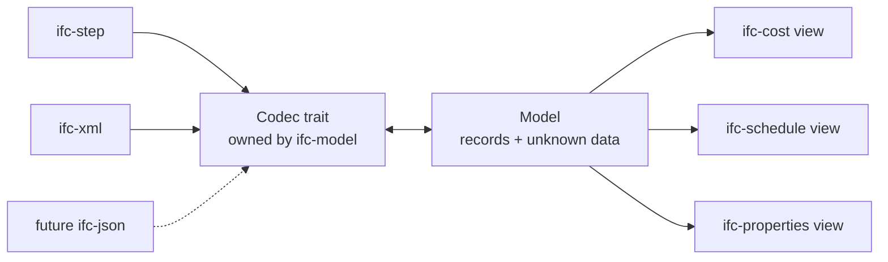
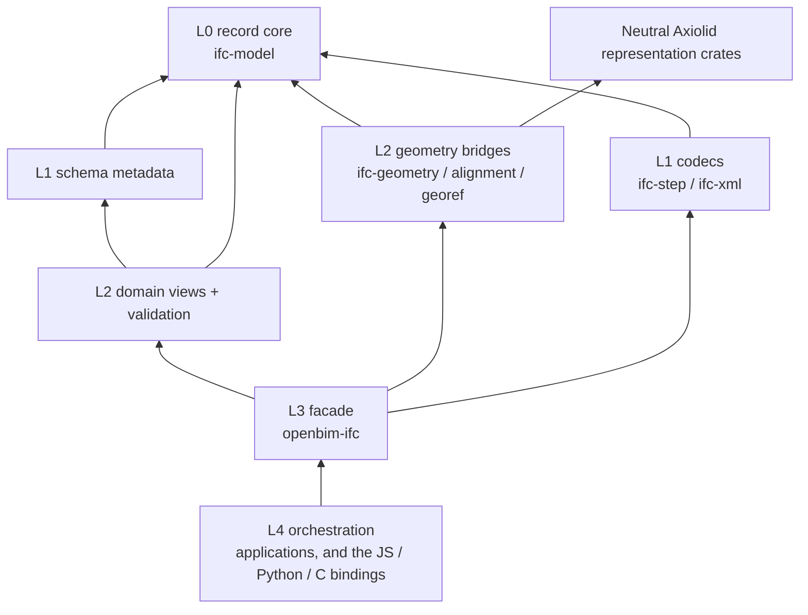

# System design

`openbim-ifc` is built around two separations. Both are enforced by tests rather
than by convention, and almost every other design choice follows from them.

## 1. The model knows no domain semantics

`ifc-model::Model` stores `(id, type_name, attributes)`. It has never heard of a
wall, a cost item, or a task. Domain crates are **views** that borrow a `&Model`
and interpret it.

```mermaid
flowchart LR
  accTitle: Structural model between codecs and domain views
  accDescr: STEP, XML, and future JSON codecs read and write one structural model. Cost, schedule, and property crates borrow that model as replaceable typed views.
  STEP["ifc-step"] --> Codec["Codec trait<br/>owned by ifc-model"]
  XML["ifc-xml"] --> Codec
  JSON["future ifc-json"] -.-> Codec
  Codec <--> Model["Model<br/>records + unknown data"]
  Model --> Cost["ifc-cost view"]
  Model --> Schedule["ifc-schedule view"]
  Model --> Properties["ifc-properties view"]
```

Three consequences, in order of importance:

**Data you do not understand still round-trips.** A file full of cost entities
parses and re-exports intact in a build compiled with *no cost crate at all*,
because storage is structural rather than a domain struct. This is the property
that makes the project safe to use while large parts of it remain unimplemented.
Verified by `openbim-ifc/tests/costing_roundtrip.rs`.

**Thin applications stay thin.** A viewer compiles only the domains it selects.
Verified by `openbim-ifc/tests/thin_build.rs`.

**Interpretations are replaceable.** A different reading of the same entities is
another crate, not a fork of the model.

## 2. The model knows no serialization

`Codec` is a trait *in the model crate*; `ifc-step` and `ifc-xml` implement it.
IFC-JSON would be a third implementation requiring no change to the model.

Format conversion is therefore not a feature — it is reading with one codec and
writing with another.

Codecs never import domain semantics. Domain crates never import codecs.

## Dependency tiers

```mermaid
flowchart BT
  accTitle: openbim-ifc dependency tiers
  accDescr: Dependencies point downward from orchestration through the facade and optional domain or geometry crates to codecs, schema metadata, and the record core.
  L4["L4 orchestration<br/>applications, and the JS / Python / C bindings"] --> L3["L3 facade<br/>openbim-ifc"]
  L3 --> Domains["L2 domain views + validation"]
  L3 --> Geometry["L2 geometry bridges<br/>ifc-geometry / alignment / georef"]
  Domains --> Schema["L1 schema metadata"]
  Domains --> Model["L0 record core<br/>ifc-model"]
  Geometry --> Model
  Geometry --> Axiolid["Neutral Axiolid representation crates"]
  L3 --> Codecs["L1 codecs<br/>ifc-step / ifc-xml"]
  Codecs --> Model
  Schema --> Model
```

Dependencies point down. Sibling domain crates do not depend on one another;
cross-domain workflows belong at L4. `ifc-model` remains schema-, codec-, and
domain-agnostic. The language bindings live in this repository at L4: they
wrap the facade, one crate per target
([ADR 0013](/adr/0013-language-bindings-wrap-the-facade)).

## Partitioning by pipeline role, not by IFC schema name

IFC resource names are evidence, not crate boundaries. The schema mixes storage,
geometry input, presentation, and domain semantics in the same resource
documents, so the crate layout follows the role a declaration plays:

1. Geometry input is lowered by `ifc-geometry`, `ifc-alignment`, or `ifc-georef`
   into format-neutral geometry values.
2. Domain semantics are borrowed projections over `ifc-model`.
3. Geometry-derived outputs such as area and volume are computed outside the
   semantic crate, then written through it by an application service.

One IFC entity may therefore have projections in two crates. `ifc-model` owns
the record; neither projection owns or duplicates it. For the resources that
mix roles, the split is:

| IFC concept | Geometry projection | Semantic projection | Orchestration |
| --- | --- | --- | --- |
| `IfcProfileDef` | exact shape in `ifc-geometry` | name/type only when needed | application chooses the use |
| `IfcMaterialProfile*` | profile reference, cardinal point, offsets in `ifc-geometry` | material, name, priority, category in `ifc-material` | application associates the product |
| `IfcMaterialLayerSetUsage` | direction and offset geometry input in `ifc-geometry` | layer identity and composition in `ifc-material` | application chooses the representation |
| `IfcElementQuantity` | none | authored values, read and write, in `ifc-properties` | application computes and populates |
| Geometric representation context | local project frame and precision in `ifc-geometry` | none | application composes the map transform |
| Map conversion, projected CRS | none | geodetic metadata and transform in `ifc-georef` | application applies it at the export/query boundary |
| Presentation appearance | none | all style semantics in `ifc-style` | renderer joins by entity ID |
| Structural analysis | geometry and profile IDs only | models, analytical members, connections, actions, loads in `ifc-structural` | solver computes results |
| Construction resources | none | capacity and allocation in `ifc-resource` | application links resources to processes and products |

Classification, resources, schedules, structural analysis, systems and cost
are deliberately separate domains, not candidates for consolidation;
`ifc-resource` is construction-resource planning and never absorbs
structural-analysis semantics.

## Where geometry stops

`ifc-geometry` answers *"what does this IFC entity mean geometrically"* and
lowers it into the neutral `axiolid-model` DAG. The bridge itself does not
triangulate, evaluate NURBS or perform booleans. Meshing is an opt-in
feature that calls a swappable backend
([ADR 0012](/adr/0012-geometry-backends-are-swappable)); the default build
links no kernel.

See [the Axiolid boundary](/architecture/axiolid-boundary).

## Context files

The repository uses progressive context files so that an agent reads only what
is on the path to its target:

- **AGENTS.md** — stable ambient context: purpose, boundaries, invariants, gates.
  A deeper file adds local rules and never repeats its parent.
- **GitHub issues** — open work. A marker in code names its issue as
  `TODO(#N)`, so the tracker and the code point at each other.

Progress logs, task lists and speculative TODOs do not belong in
**AGENTS.md**. `ifc-model/tests/progressive_context.rs` enforces that the
required context files exist, stay small, and point at files that exist, and
`cargo run -p xtask -- todo --check` rejects a marker without an issue.

## Further reading

- [Crate map](/architecture/crates)
- [Architecture decisions](/adr/0001-entity-graph-free-of-domain-and-codec)
- [Capabilities and status](/capabilities)
